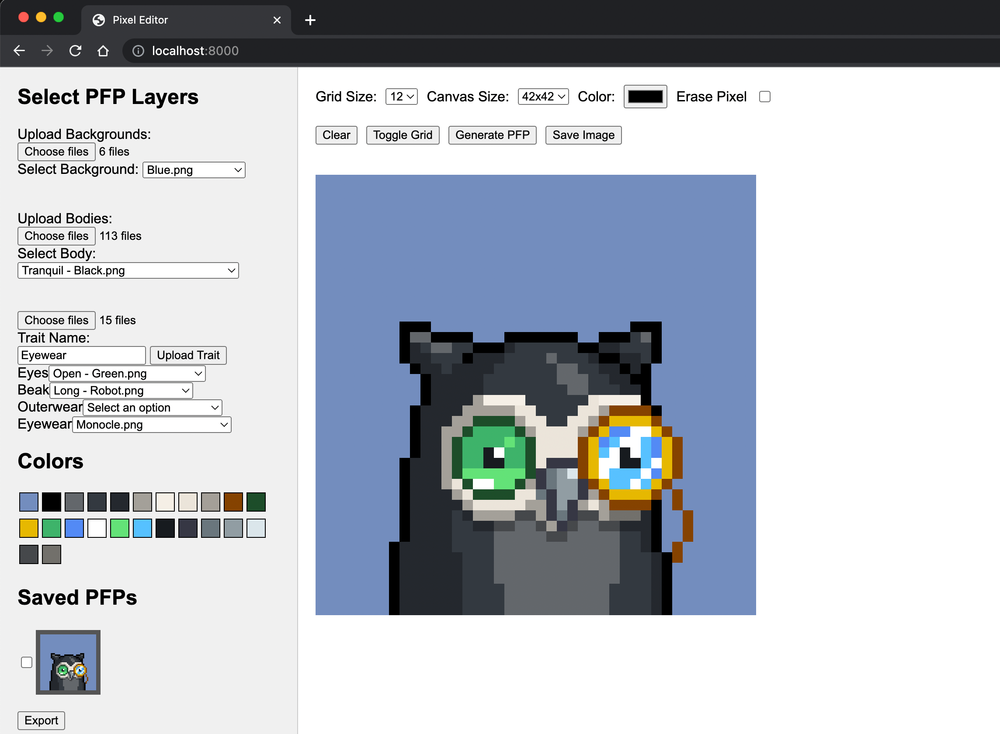

# PFP (Profile Picture) Generator

PFP Generator is a simple web application that allows users to create custom profile pictures by selecting different layers and traits. Users can upload images for body and trait layers, and then mix and match the layers to generate their desired profile pictures.

<div style="display:block;margin:auto;height:80%;width:60%">
  
</div>

## Features

- Upload body layers and traits
- Easily select layers using dropdown menus
- Real-time preview of the generated profile picture
- Download the generated profile picture

## Example Assets

This project includes example assets from the [Moonbirds](https://github.com/proofxyz/moonbirds-assets) collection. You can use these assets to get started with creating your custom profile pictures. 

## How to Run

### Method 1: Using Python

If you have Python installed on your computer, you can use the built-in HTTP server to run the app. Navigate to the project directory in your terminal and run the following command:

- For Python 3.x:

```
python -m http.server
```

- For Python 2.x:

```
python -m SimpleHTTPServer
```

After running the command, open your browser and navigate to `http://localhost:8000`.

### Method 2: Using an Online Editor

You can also use an online editor like [Replit](https://replit.com/) or [CodeSandbox](https://codesandbox.io/) to run the project. Simply create a new project and upload your project files, then click "Run" to start the app.

Usage

1. Upload background and body layers by clicking on the "Choose Files" buttons under the "Background" and "Body" sections.
2. Upload traits by entering a trait name, selecting images, and clicking the "Upload Trait" button.
3. Select the desired body layer and traits using the dropdown menus.
4. Click the "Generate PFP" button to generate your custom profile picture.
5. Save the generated profile picture by clicking on the "Save Image" button.
6. Select the PFPs you want to export from Save PFPs section, and click on the "Export" button.